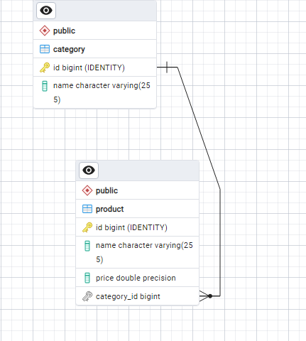

# Product Management System

A robust Spring Boot application designed for efficient management of products and categories. This system provides CRUD operations and leverages a binary tree data structure for optimized categorization and retrieval of products.

## Requirements

### Functional Requirements

1. **Product Management**
    - Add, edit, delete, and view products.
    - Products should have attributes like ID, name, price, and category.

2. **Category Management**
    - Add, edit, delete, and view categories.
    - Categories should be managed in a binary tree structure for efficient retrieval.

3. **API Endpoints**
    - CRUD operations for products and categories.
    - Search products by various criteria.
4. **Managing products under category using binary tree**
    - add product in binary tree, delete, search

### Non-Functional Requirements

1. **Performance**
    - The system should handle up to 1000 concurrent requests.
    - Response time for API calls should be under 1 second for typical queries.

2. **Scalability**
    - The application should be designed to scale horizontally.

3. **Security**
    - Ensure secure communication with HTTPS.

4. **Usability**
    - The API should be well-documented using Swagger.
    - Clear error messages and validation feedback for API consumers.

## Technologies Used
- Java 22
- Spring Boot 2.6.8
- MongoDB 7.0
- Postgresql
- Swagger for API documentation

## Getting Started

### Prerequisites
- Ensure all the requirements listed above are met.

### Installation
1. Clone the repository.
2. Navigate to the project directory.
3. Run `mvn clean install` to build the project.
4. Run `java -jar target/ProductManagementSystem.jar` to start the application.

## Configuration
- **Environment Variables**: No specific environment variables required.
- **Configuration Files**: Customize `application.properties` for database settings.

## Usage
- Once the application is running, access the API endpoints using a tool like Postman or a web browser.
- Example:
   - Create a new product: `POST http://localhost:8080/api/products`
   - Get all products: `GET http://localhost:8080/api/products`

## API Documentation
- The API endpoints are documented using Swagger. Access the Swagger UI at `http://localhost:8080/swagger-ui/index.html`.

## Tests
- Run unit tests using `mvn test`.

  ### DatabaseSchema : postgresql

 

### Binarytree for category and products are stored in Mongodb

### Project video

### https://www.loom.com/share/a8fff078ea974f5092fcf6200a5d77ee

